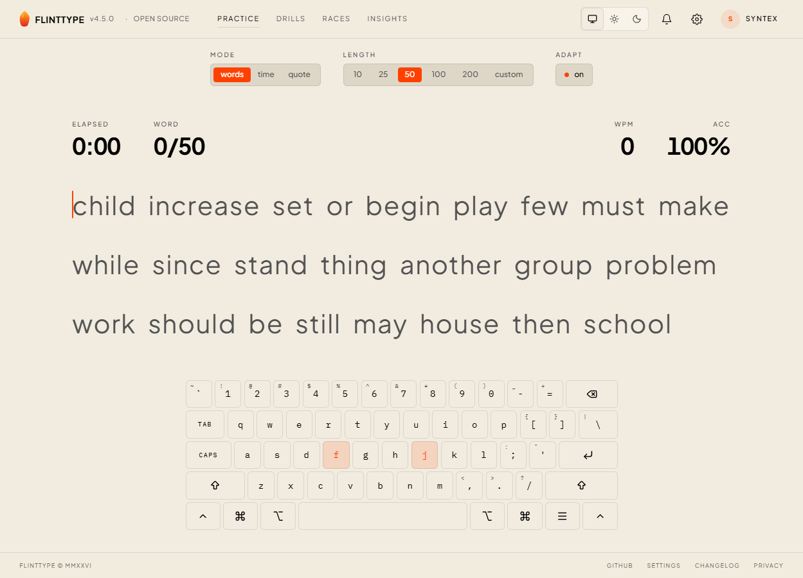
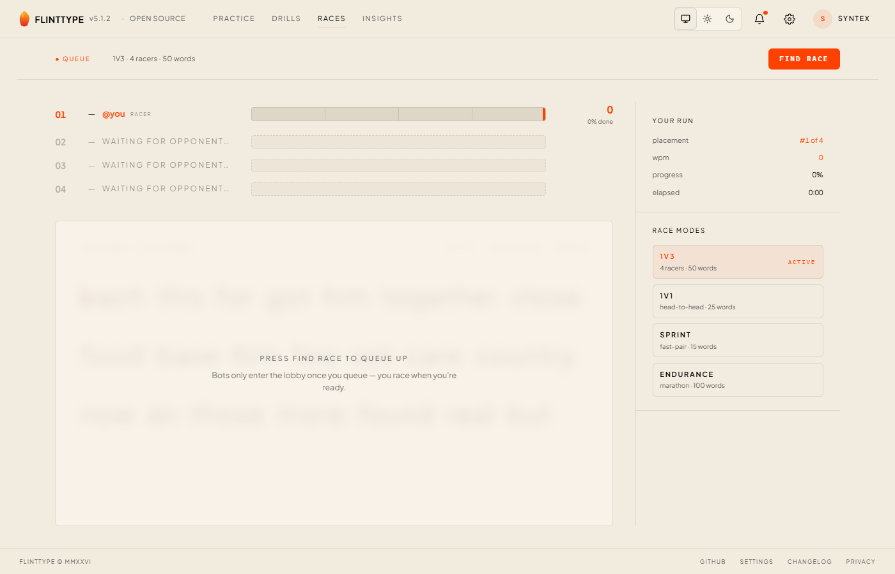

<div align="center">


# flinttype

**Open-source typing speed test — editorial-mechanical, deeply customisable, adaptive.**

[](https://flinttype.com)
[](LICENSE)
[](https://nextjs.org)
[](https://react.dev)
[](https://www.typescriptlang.org)
[](CONTRIBUTING.md)

[**flinttype.com**](https://flinttype.com) · [Customise](https://flinttype.com/customise) · [Drills](https://flinttype.com/drills) · [Race](https://flinttype.com/race) · [Leaderboard](https://flinttype.com/leaderboard) · [Changelog](https://flinttype.com/changelog)

</div>

---

flinttype is a typing speed test in the same product space as Monkeytype and 10fastfingers, with a different aesthetic and architectural bias. JetBrains Mono everywhere, hairline borders, a single coral accent against paper-and-ink. Every visual surface and behaviour is user-customisable; the practice surface can pull adaptive word lists biased toward your own weak spots.

<p align="center">
  
</p>

## Features

- **Practice** — Words / Time / Quote modes with custom counts, live WPM/CPM/accuracy/burst readouts (each independently togglable), live virtual keyboard widget in four physical layouts × four logical layouts × five visual designs.
- **Adaptive mode** — server-side engine scores you against your own bigram/trigram/word/motor-feature models and biases the next word list toward weak spots.
- **Drills** ([`/drills`](https://flinttype.com/drills)) — burst (rep-based) and sudden-death (any-error-resets) drills over the top-1000 words, trigrams, pangrams, your worst words, your weakest bigrams.
- **Races** ([`/race`](https://flinttype.com/race)) — 4-player real-time races backed by an in-memory room engine with SSE broadcasts. Public matchmaking with bot fill, or private challenge lobbies via shareable slug.
- **Profiles, leaderboards, insights** — historical results, per-user analytics, mode/window-scoped global rankings.
- **MonkeyType import** — pull your existing MonkeyType account via Ape Key; results + stats decrypt client-side before persisting.
- **Deep customisation** ([`/customise`](https://flinttype.com/customise)) — 11+ palettes, font picker, caret style/thickness/blink/smooth, keymap, chrome density (Editorial / Minimal / Stripped presets), background images, line width, opacity controls. Everything persists as a JSON prefs blob.

<p align="center">
  
</p>

## Quick start

```bash
git clone https://github.com/saifkhan2003/flinttype.git
cd flinttype
yarn install
yarn dev          # http://localhost:3000
```

That's the full path to a working local install — Clerk runs in keyless mode and Postgres falls back to PGlite-Node (file-backed local Postgres in `./.data/pglite/`). No env vars required to boot.

To wire real services, copy keys into `.env.local` (gitignored):

```bash
# Clerk (optional in dev — keyless mode auto-generates temporary keys)
NEXT_PUBLIC_CLERK_PUBLISHABLE_KEY=pk_test_...
CLERK_SECRET_KEY=sk_test_...

# Neon Postgres (optional in dev — defaults to PGlite-Node)
DATABASE_URL=postgresql://...

# OpenRouter (only needed for AI-backed routes)
OPENROUTER_API_KEY=sk-or-v1-...
```

Full env table: [`docs/backend-rules.md`](docs/backend-rules.md#logging) (logging) · [`docs/auth.md`](docs/auth.md) (Clerk) · [`docs/database.md`](docs/database.md) (Neon / PGlite).

## Scripts

```bash
yarn dev               # next dev (http://localhost:3000)
yarn build             # production build
yarn start             # serve the production build
yarn lint              # eslint
yarn test              # vitest run
yarn test:watch        # vitest in watch mode

# Database
yarn db:generate       # drizzle-kit generate — writes migration SQL
yarn db:migrate        # apply migrations to local DB
yarn db:push           # push schema without migration files (dev only)
yarn db:studio         # drizzle-kit studio (visual table browser)

# Tooling
yarn themes:add <url>  # add a tweakcn.com palette
yarn fonts:download    # pull fonts into public/fonts
```

## Stack

| Layer       | What                                                                                  |
|-------------|---------------------------------------------------------------------------------------|
| Framework   | [Next.js 16](https://nextjs.org) (App Router) + [React 19](https://react.dev)         |
| Styling     | [Tailwind CSS v4](https://tailwindcss.com) + [shadcn/ui](https://ui.shadcn.com) (`base-nova`) |
| Language    | TypeScript 5 (strict)                                                                 |
| Validation  | [Zod 4](https://zod.dev) on every wire input                                          |
| Database    | [Drizzle ORM](https://orm.drizzle.team) → [Neon Postgres](https://neon.tech) (prod) / [PGlite](https://pglite.dev) (dev) |
| Auth        | [Clerk](https://clerk.com)                                                            |
| Tests       | [Vitest 4](https://vitest.dev) (backend + isomorphic helpers; UI tested manually)     |
| Package mgr | [Yarn classic](https://classic.yarnpkg.com) (1.x), pinned                             |

## Architecture in 30 seconds

The backend is a typed route tree rooted at `src/server/router.ts`. A single catch-all dispatcher at `src/app/api/[...path]/route.ts` resolves the URL path, walks the tree, runs the middleware pipeline (global → namespace → route → `validate` → `handler`), and returns JSON. The frontend consumes it via `useBackend()` — a recursive `Proxy` typed from `typeof router`. Adding a route on the server immediately makes it available and typed on the client with no codegen.

```
backend.users.admins.list()
  └─ POST /api/users/admins/list
      └─ logging → requireAuth → requireAdmin → validate → handler
```

Deep dive: [`docs/backend-rules.md`](docs/backend-rules.md). It's authoritative — read it before adding routes.

## Project documentation

| Doc                                                  | Scope                                                          |
|------------------------------------------------------|----------------------------------------------------------------|
| [`docs/backend-rules.md`](docs/backend-rules.md)     | Backend architecture, 12 rules, middleware patterns, testing   |
| [`docs/ui-law.md`](docs/ui-law.md)                   | Design system, colours, spacing, typography, mobile-first      |
| [`docs/organization.md`](docs/organization.md)       | File length thresholds, where new files go, anti-patterns      |
| [`docs/seo.md`](docs/seo.md)                         | Page metadata, semantic HTML, `llms.txt`, sitemap              |
| [`docs/auth.md`](docs/auth.md)                       | Clerk integration, `requireAuth` / `requireAdmin`, testing     |
| [`docs/database.md`](docs/database.md)               | Drizzle layer, schema, server + client tiers, migrations       |
| [`specification.md`](specification.md)               | Full product specification — every feature, every surface      |

## Contributing

Contributions of every size are welcome — typo fixes through to whole new drill modes. Start with [**CONTRIBUTING.md**](CONTRIBUTING.md) for the dev loop, code style, commit format, and PR process. Discussions happen in [GitHub Issues](https://github.com/saifkhan2003/flinttype/issues) and [Discussions](https://github.com/saifkhan2003/flinttype/discussions).

Before opening a PR, please read:
- [**Code of Conduct**](CODE_OF_CONDUCT.md) — Contributor Covenant 2.1
- [**Security Policy**](SECURITY.md) — how to report vulnerabilities privately
- [**Support**](SUPPORT.md) — where to ask questions

## License

[MIT](LICENSE) © 2025 Saif Khan and flinttype contributors.

---

<div align="center">
<sub>Built with care in JetBrains Mono. ¶</sub>
</div>
