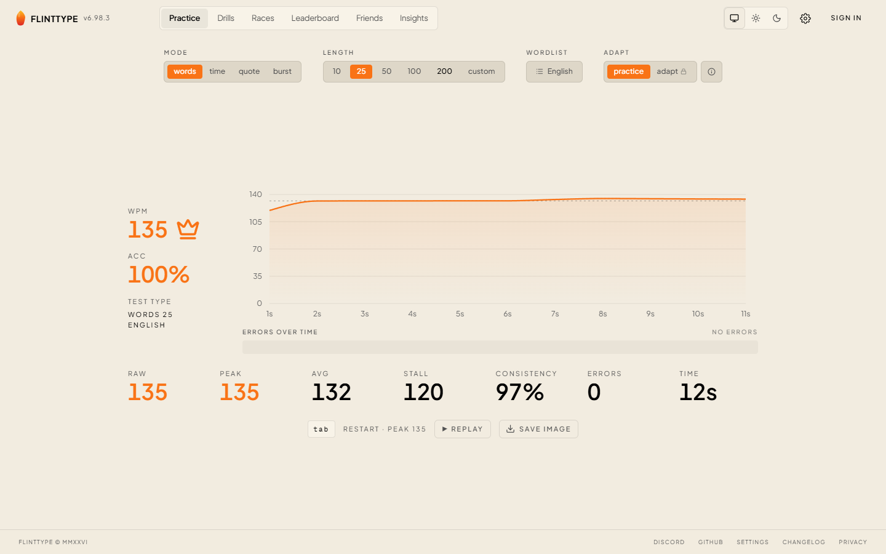
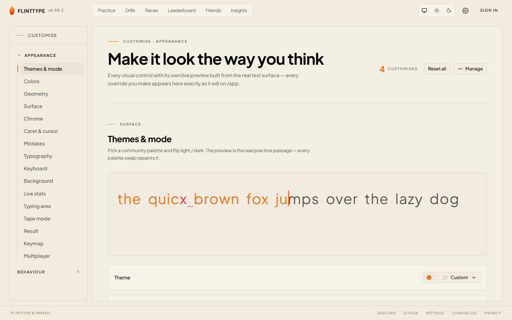
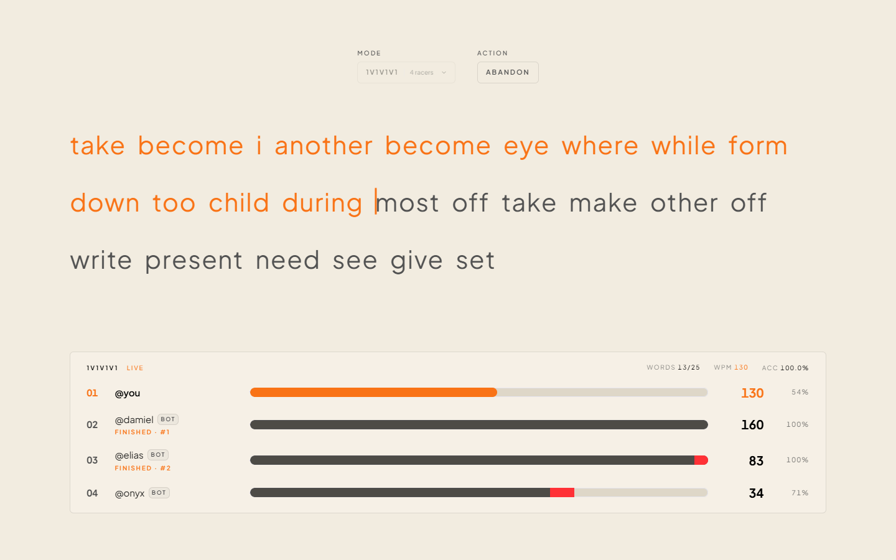
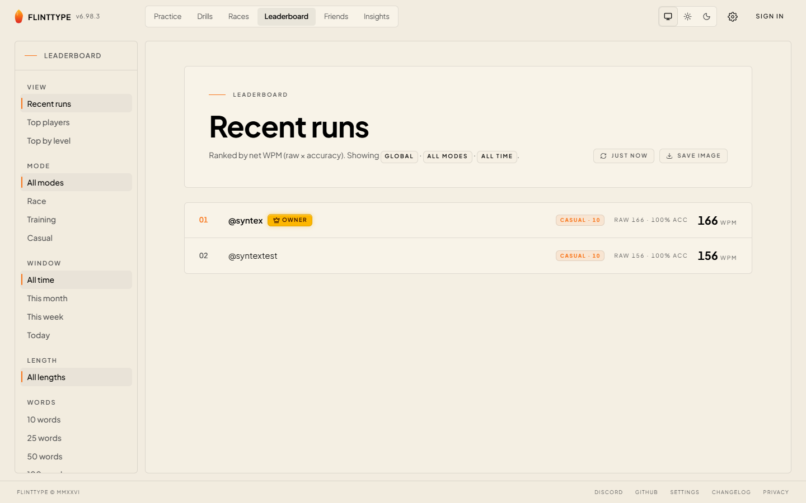
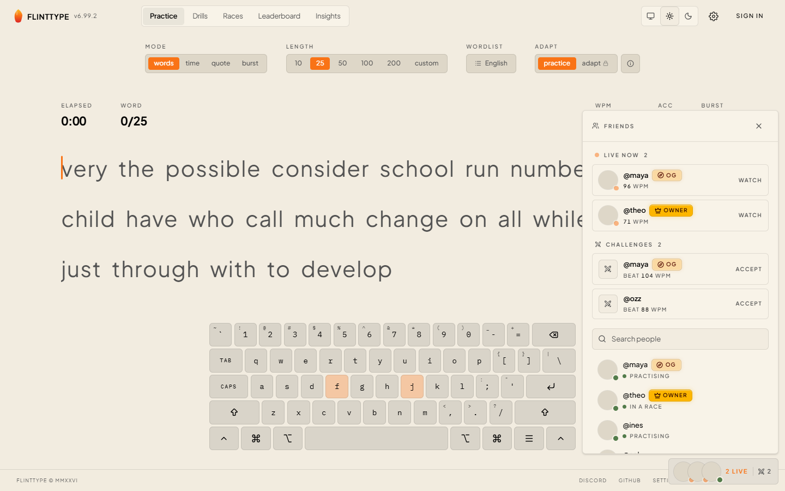
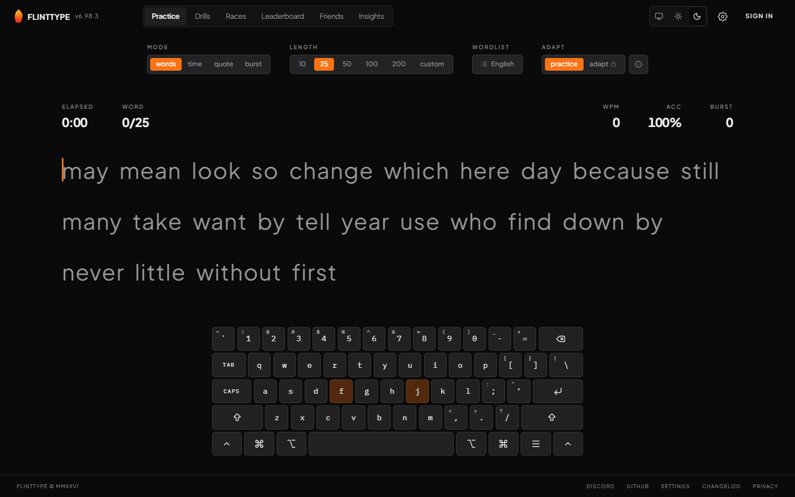
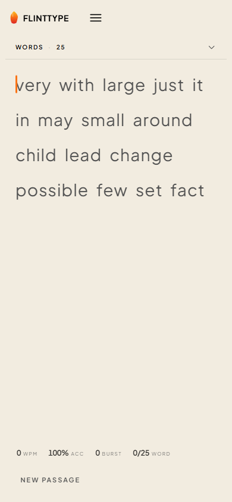

<div align="center">


# flinttype

**Open-source typing speed test — editorial-mechanical, deeply customisable, adaptive.**

[](https://flinttype.com)
[](LICENSE)
[](https://nextjs.org)
[](https://react.dev)
[](https://www.typescriptlang.org)
[](CONTRIBUTING.md)

[**flinttype.com**](https://flinttype.com) · [Customise](https://flinttype.com/customise) · [Drills](https://flinttype.com/drills) · [Race](https://flinttype.com/race) · [Leaderboard](https://flinttype.com/leaderboard) · [Changelog](https://flinttype.com/changelog)

</div>

---

flinttype is a typing speed test in the same product space as Monkeytype and 10fastfingers, with a different aesthetic and architectural bias. JetBrains Mono everywhere, hairline borders, a single coral accent against paper-and-ink. Every visual surface and behaviour is user-customisable; the practice surface can pull adaptive word lists biased toward your own weak spots; and a typed backend tree means a route added on the server is instantly available and type-checked on the client with no codegen.

<p align="center">
  
</p>

## Highlights

- **A typing test you can actually finish your way** — Words / Time / Quote / Burst modes, custom counts, English or common-words lists.
- **Adaptive practice** — a server-side engine models your weak bigrams, trigrams, words, and motor features and biases the next passage toward them.
- **Real-time multiplayer** — up to 8-player races over SSE, with bot fill or private lobbies, plus 1-on-1 duels against a friend's ghost.
- **A friends dock, not a friends page** — a small corner dock surfaces who's typing live, challenges waiting for you, and everyone you follow, on every screen.
- **Customisation to the studs** — 11+ palettes, fonts, caret, keymap, chrome density, background images, mistake styles, opacity, line width. Everything persists as a JSON prefs blob.
- **Boringly solid foundations** — typed route tree, Zod on every wire input, a unit test co-located with every backend module, Drizzle over Neon (prod) / PGlite (dev), Clerk auth.

## Screenshots

|  |  |
|---|---|
|  |  |
| **Run report** — WPM trace, peak / stall / consistency, PB crown, replay & save-image. | **Customise** — every control has its own live preview built from the real test surface. |
|  |  |
| **Race** — live lanes, per-racer WPM, error markers, bot fill or private lobbies. | **Leaderboard** — global rankings filtered by mode, window, and length. |
|  |  |
| **Friends dock** — live now, pending challenges, and a searchable directory, on every screen. | **Theming** — light / dark plus community palettes, all swapping live. |

<p align="center">
  
</p>

> Profile (skill radar, activity heatmap, level / XP, rank badge), Insights, and Drills are signed-in surfaces — see them live on [flinttype.com](https://flinttype.com).

## Features in depth

- **Practice** — Words / Time / Quote / Burst modes with custom counts; live WPM / CPM / accuracy / burst / error readouts (each independently togglable); a live virtual keyboard in four physical layouts × four logical layouts × five visual designs.
- **Adaptive mode** — scores you against your own bigram / trigram / word / motor-feature models and biases the next word list toward weak spots.
- **Drills** ([`/drills`](https://flinttype.com/drills)) — burst (rep-based) and sudden-death (any-error-resets) drills over the top-1000 words, trigrams, pangrams, your worst words, and your weakest bigrams.
- **Races** ([`/race`](https://flinttype.com/race)) — real-time races backed by an in-memory room engine with SSE broadcasts: public matchmaking with bot fill, free-for-all lobbies for up to 8 real players, word-count or timed formats, and shareable private challenge links. See [`docs/multiplayer.md`](docs/multiplayer.md).
- **Friends, duels & live spectate** — follow people, and a global **friends dock** surfaces who's broadcasting live, pending challenges, and your directory. Watch a friend type in real time at `/live/<user>`, or challenge them to beat one of your runs (duels).
- **Profiles, leaderboards, insights** — historical results and per-user analytics, a four-spoke skill radar, an activity heatmap, level / XP, a self-selected rank badge, and mode / window / length-scoped global rankings.
- **MonkeyType import** — pull your existing MonkeyType account via Ape Key; results decrypt client-side before persisting.
- **Deep customisation** ([`/customise`](https://flinttype.com/customise)) — 11+ palettes, light / dark, font picker, caret style / thickness / blink / smooth, keymap, chrome density (Editorial / Minimal / Stripped presets), background images, mistake styles, line width, and opacity. A `Cmd/Ctrl+K` command palette flips most settings without leaving the keyboard.

## Quick start

```bash
git clone https://github.com/F12-Syntex/FlintType.git
cd flinttype
yarn install
yarn dev          # http://localhost:3000
```

That's the full path to a working local install — Clerk runs in keyless mode and Postgres falls back to PGlite-Node (file-backed local Postgres in `./.data/pglite/`). No env vars required to boot.

To wire real services, copy keys into `.env.local` (gitignored):

```bash
# Clerk (optional in dev — keyless mode auto-generates temporary keys)
NEXT_PUBLIC_CLERK_PUBLISHABLE_KEY=pk_test_...
CLERK_SECRET_KEY=sk_test_...

# Neon Postgres (optional in dev — defaults to PGlite-Node)
DATABASE_URL=postgresql://...

# OpenRouter (only needed for AI-backed routes)
OPENROUTER_API_KEY=sk-or-v1-...
```

Full env tables: [`docs/backend-rules.md`](docs/backend-rules.md#logging) (logging) · [`docs/auth.md`](docs/auth.md) (Clerk) · [`docs/database.md`](docs/database.md) (Neon / PGlite) · [`docs/multiplayer.md`](docs/multiplayer.md) (race authority).

## Scripts

```bash
yarn dev               # next dev (http://localhost:3000)
yarn build             # apply migrations, then production build
yarn start             # serve the production build
yarn lint              # eslint
yarn test              # vitest run (backend + isomorphic helpers)
yarn test:watch        # vitest in watch mode

# Database
yarn db:generate       # drizzle-kit generate — writes migration SQL
yarn db:migrate        # apply migrations to local DB
yarn db:push           # push schema without migration files (dev only)
yarn db:studio         # drizzle-kit studio (visual table browser)

# Tooling
yarn themes:add <url>  # add a tweakcn.com palette
yarn fonts:download    # pull fonts into public/fonts
yarn skills:baseline   # recompute the skill-radar average baseline from real data
```

## Stack

| Layer       | What                                                                                  |
|-------------|---------------------------------------------------------------------------------------|
| Framework   | [Next.js 16](https://nextjs.org) (App Router) + [React 19](https://react.dev)         |
| Styling     | [Tailwind CSS v4](https://tailwindcss.com) + [shadcn/ui](https://ui.shadcn.com) (`base-nova`) |
| Motion      | [Framer Motion](https://www.framer.com/motion/) (sparingly — animation is the exception) |
| Charts      | [Recharts](https://recharts.org) (line-art SVG)                                       |
| Language    | TypeScript 5 (strict)                                                                 |
| Validation  | [Zod 4](https://zod.dev) on every wire input                                          |
| Database    | [Drizzle ORM](https://orm.drizzle.team) → [Neon Postgres](https://neon.tech) (prod) / [PGlite](https://pglite.dev) (dev) |
| Auth        | [Clerk](https://clerk.com)                                                            |
| Tests       | [Vitest 4](https://vitest.dev) (backend + isomorphic helpers; UI tested manually)     |
| Package mgr | [Yarn classic](https://classic.yarnpkg.com) (1.x), pinned                             |

## Architecture in 30 seconds

The backend is a **typed route tree** rooted at `src/server/router.ts`. A single catch-all dispatcher at `src/app/api/[...path]/route.ts` resolves the URL path, walks the tree, runs the middleware pipeline (global → namespace → route → `validate` → `handler`), and returns JSON. The frontend consumes it via `useBackend()` — a recursive `Proxy` typed from `typeof router`. Add a route on the server and it's immediately available and typed on the client, no codegen.

```
backend.users.admins.list()
  └─ POST /api/users/admins/list
      └─ logging → requireAuth → requireAdmin → validate → handler
```

Two data tiers share one Drizzle schema: a **server tier** (Neon in prod, PGlite-Node in dev) reached from handlers via `ctx.db.<repo>.<method>`, and a **client tier** (browser PGlite) reached via `useLocalDb()`. Real-time multiplayer state lives in a single warm Node process (the "race authority"); the rest of the app runs serverless and proxies race writes to it. Deep dives: [`docs/backend-rules.md`](docs/backend-rules.md), [`docs/database.md`](docs/database.md), [`docs/multiplayer.md`](docs/multiplayer.md).

## Project structure

```
src/
├─ app/                      # Next.js App Router — pages + route-scoped _components
│  ├─ api/[...path]/         # the single catch-all backend dispatcher
│  ├─ _components/           # shared app chrome (TopBar, footer, banners)
│  ├─ customise/ drills/ race/ leaderboard/ profile/ insights/ duels/ live/ …
│  ├─ providers.tsx          # global providers, command palette, friends dock
│  └─ globals.css            # design tokens + theme variables
├─ components/
│  ├─ ui/                    # shadcn primitives
│  ├─ ft/                    # flinttype design-system primitives (Logo, Avatar, UserTag, …)
│  └─ friends-dock/          # the global friends dock
├─ server/
│  ├─ router.ts              # typed route tree root
│  ├─ routes/                # namespaces — handlers + co-located *.test.ts
│  ├─ middleware/            # auth, logging, rate-limit
│  └─ race/                  # in-memory multiplayer authority
├─ db/
│  ├─ schema/                # shared Drizzle tables
│  └─ server/ · client/      # per-tier repositories (+ co-located tests)
├─ lib/                      # isomorphic helpers (backend client, errors, themes, …)
└─ types/                    # every domain type + Zod schema (single source of truth)
docs/                        # the seven authoritative guides (below)
```

## Project documentation

The `docs/` directory is authoritative — read the relevant guide before changing code in that area. They're auto-loaded into the agent context via [`CLAUDE.md`](CLAUDE.md).

| Doc                                                  | Scope                                                                 |
|------------------------------------------------------|-----------------------------------------------------------------------|
| [`docs/backend-rules.md`](docs/backend-rules.md)     | Backend architecture, the 12 rules, middleware, errors, logging, testing |
| [`docs/ui-law.md`](docs/ui-law.md)                   | Design system — colours, spacing, typography, mobile-first, primitives, the friends dock |
| [`docs/organization.md`](docs/organization.md)       | File-length thresholds, where new files go, anti-patterns             |
| [`docs/seo.md`](docs/seo.md)                         | Page metadata, semantic HTML, `llms.txt`, sitemap                     |
| [`docs/auth.md`](docs/auth.md)                       | Clerk integration, `requireAuth` / `requireAdmin`, the local user mirror |
| [`docs/database.md`](docs/database.md)               | Drizzle layer, schema, server + client tiers, migrations              |
| [`docs/multiplayer.md`](docs/multiplayer.md)         | Race authority split, the shared-secret proxy, live spectate          |
| [`specification.md`](specification.md)               | Full product specification — every feature, every surface             |

## Contributing

Contributions of every size are welcome — typo fixes through to whole new drill modes. Start with [**CONTRIBUTING.md**](CONTRIBUTING.md) for the dev loop, code style, commit format, and PR process. Two house rules worth knowing up front: every backend module ships with a co-located test in the same commit ([`docs/backend-rules.md`](docs/backend-rules.md) R12), and any new UI pattern is documented in [`docs/ui-law.md`](docs/ui-law.md) *before* it's used. Discussions happen in [GitHub Issues](https://github.com/F12-Syntex/FlintType/issues) and [Discussions](https://github.com/F12-Syntex/FlintType/discussions).

## License

[MIT](LICENSE) © 2025 Saif Khan and flinttype contributors.

---

<div align="center">
<sub>Built with care in JetBrains Mono. ¶</sub>
</div>
